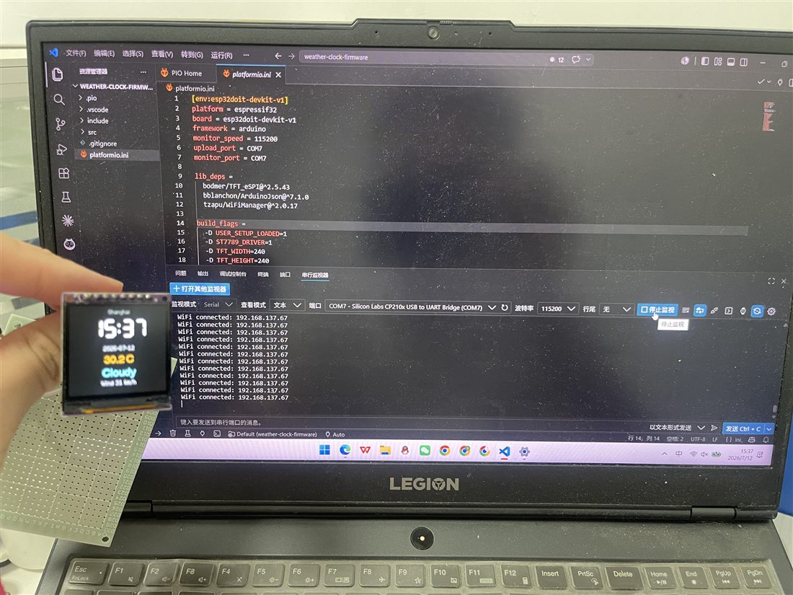
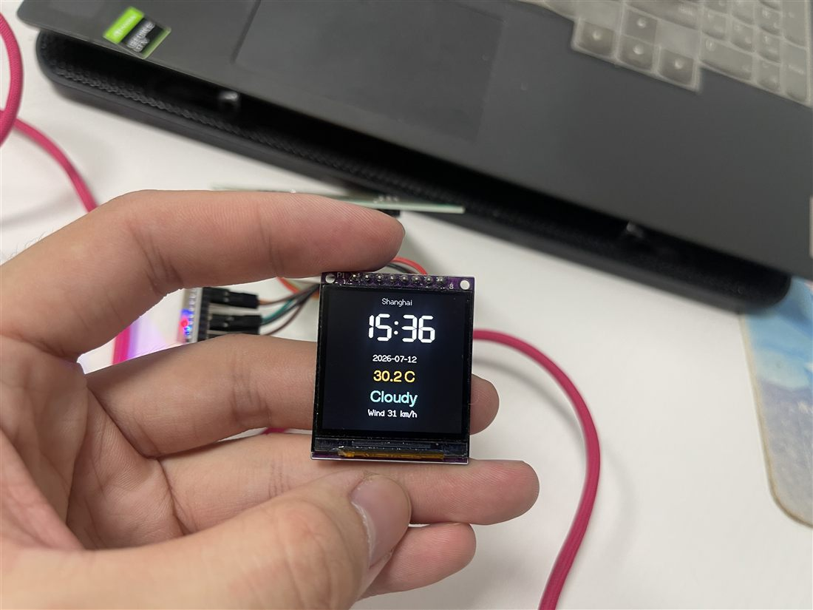
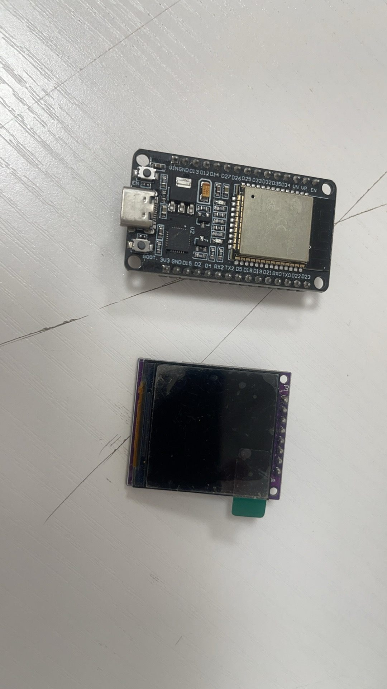
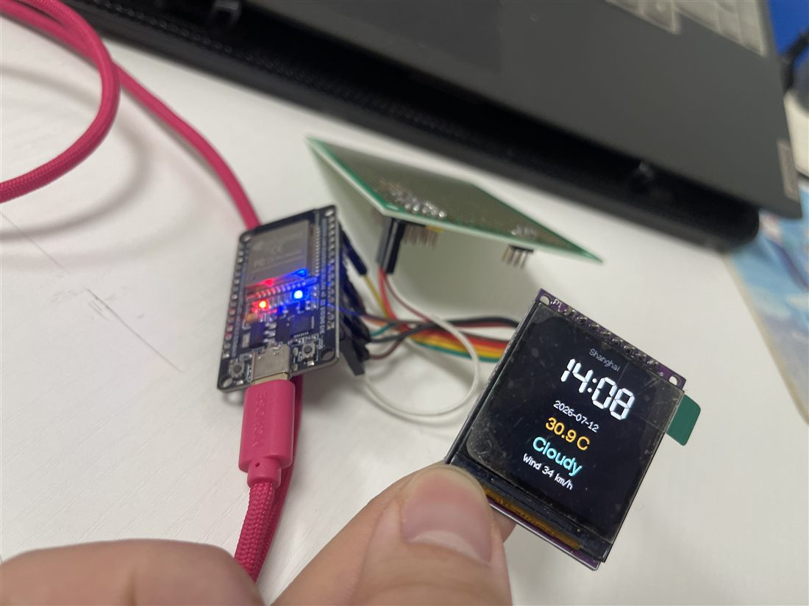

# ESP32 Weather Clock

一个基于 ESP32 和 1.54 寸 240x240 SPI TFT 彩屏的桌面天气时钟。固件使用 PlatformIO + Arduino for ESP32 开发，支持网页配网、NTP 自动校时和 Open-Meteo 实时天气显示。

<p align="center">
  
</p>

## 功能

- 1.54 寸 240x240 ST7789 彩屏显示
- WiFiManager 自动配网，无需把 Wi-Fi 密码写进源码
- NTP 自动校时，默认中国时区 UTC+8
- Open-Meteo 天气接口，无需天气 API Key
- 显示城市、时间、日期、温度、天气状态和风速
- Wi-Fi 或天气接口异常时保留清晰的离线状态提示

## 效果展示

| 成品运行 | 开发调试 |
| --- | --- |
|  |  |

| 硬件组合 | 接线测试 |
| --- | --- |
|  |  |

## 硬件

已验证硬件：

- ESP32 DevKit 类开发板，CP210x USB 转串口
- 1.54 寸 240x240 SPI TFT 屏，ST7789 驱动
- 杜邦线、面包板或焊接转接板
- USB 供电

屏幕接线：

| TFT 屏幕 | ESP32 |
| --- | --- |
| `GND` | `GND` |
| `VCC` | `3V3` |
| `SCL` / `SCK` / `CLK` | `GPIO18` |
| `SDA` / `DIN` / `MOSI` | `GPIO23` |
| `RES` / `RST` | `GPIO4` |
| `DC` / `A0` | `GPIO2` |
| `CS` | `GPIO5` |
| `BLK` / `LED` | `3V3` |

更详细的接线记录见 [hardware/wiring.md](hardware/wiring.md)。

## 编译和烧录

1. 安装 [VS Code](https://code.visualstudio.com/) 和 PlatformIO 插件。
2. 打开固件目录：

   ```text
   source/weather-clock-firmware
   ```

3. 连接 ESP32，按需修改 [platformio.ini](source/weather-clock-firmware/platformio.ini) 里的串口：

   ```ini
   upload_port = COM7
   monitor_port = COM7
   ```

4. 编译：

   ```bash
   pio run
   ```

5. 烧录：

   ```bash
   pio run --target upload
   ```

## 配网

首次启动或连接失败时，设备会创建热点：

```text
ESP32-WeatherClock
```

连接该热点后，浏览器打开：

```text
http://192.168.4.1
```

选择你的 Wi-Fi 并输入密码。配置成功后设备会连接网络、同步 NTP 时间并拉取天气。

## 修改城市

默认城市为上海。要修改城市，在 [include/secrets.example.h](source/weather-clock-firmware/include/secrets.example.h) 中参考下面三个字段，并在本地 `include/secrets.h` 中调整：

```cpp
#define WEATHER_LATITUDE "31.2304"
#define WEATHER_LONGITUDE "121.4737"
#define WEATHER_LOCATION_NAME "Shanghai"
```

`include/secrets.h` 已被 `.gitignore` 排除，不会提交到仓库。

## 项目结构

```text
.
├── docs/images/                 # README 使用的压缩展示图
├── hardware/                    # 接线说明
├── source/weather-clock-firmware # PlatformIO 固件工程
└── README.md
```

## License

MIT License. See [LICENSE](LICENSE).

